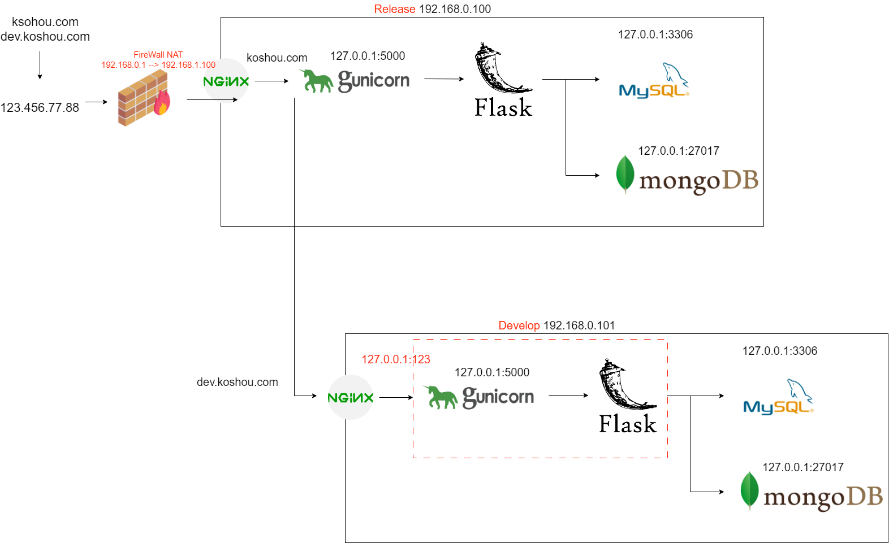

# Simple Services Platform

Simple Services Platform is a framework written in python(Flask) and use Gunicorn as WSGI server.  
It's a backend services which including Login system(JWT, ip_address checking), mail service and websocket.

- Use SQLAlchemy and ORM to defined MySQL data table and accessed database.
- Use pymongo and ORM to accessed NO-SQL database.

## Quick Start

## Deploy Project

1. Install the dependencies:

   ```
   $ pip install -r requirements.txt
   ```

2. Run the server:

   ```
   $ gunicorn -c wsgi_config.py wsgi:app
   ```

3. Navigate to [http://localhost:5000](http://localhost:5000)

## Backup Database

- [Crontab task](#crontab)

## Restore Database

1. Restore MySQL:
   ```
   $ gzip -d {{.gzfile path}}
   $ mysql -u {{username}} -p{{password}} {{databasename}} < {{.sql path}}
   ```
2. Restore MongoDB:
   ```
   mongorestore --port={{port number}} d {{databasename}} --drop {{path}}
   ```

## Server instance structure



# crontab

```
#開機執行
@reboot sleep 30; /home/koshou/Server/scripts/start.sh
#執行產報告任務
*/5 * * * * sh /home/koshou/Server/scripts/crontab.sh
#執行備份任務
30 00 * * * sh /home/koshou/Server/scripts/backup.sh
```

# Nginx Setting

## Develop

```
server {
  listen 80 default_server;
  listen [::]:80 default_server;
  server_name 192.168.0.100;
  location /{
    root /home/koshou/dist/frontend/;
    index  index.html index.htm;
    try_files $uri $uri/ /index.html;
    add_header Cache-Control 'no-store, no-cache';
  }
  location /api {
    proxy_pass http://127.0.0.1:5000;
    proxy_http_version 1.1;
    proxy_set_header X-Real-IP $remote_addr;
    proxy_set_header X-Forwarded-For $proxy_add_x_forwarded_for;
  }
}

```

## Release

```
server {
  listen 80 default_server;
  listen [::]:80 default_server;
  root /var/www/html;
  index index.html index.htm index.nginx-debian.html;
  server_name 192.168.0.100;
  location / {
    proxy_pass http://127.0.0.1:5000;
  }
}

server {
  root /var/www/html;
  index index.html index.htm index.nginx-debian.html;
  server_name report.koshou.com; # managed by Certbot
  location / {
    proxy_pass http://127.0.0.1:5000;
    proxy_http_version 1.1;
    proxy_set_header X-Real-IP $remote_addr;
    proxy_set_header X-Forwarded-For $proxy_add_x_forwarded_for;
  }
}
server{
  server_name dev.report.koshou.com; # managed by Certbot
  location / {
    proxy_pass http://192.168.0.100;
    proxy_http_version 1.1;
    proxy_set_header X-Real-IP $remote_addr;
    proxy_set_header X-Forwarded-For $proxy_add_x_forwarded_for;
  }
}
server{
  server_name api.external.koshou.com;
  location / {
    proxy_pass http://127.0.0.1:5000;
  }
}
```
