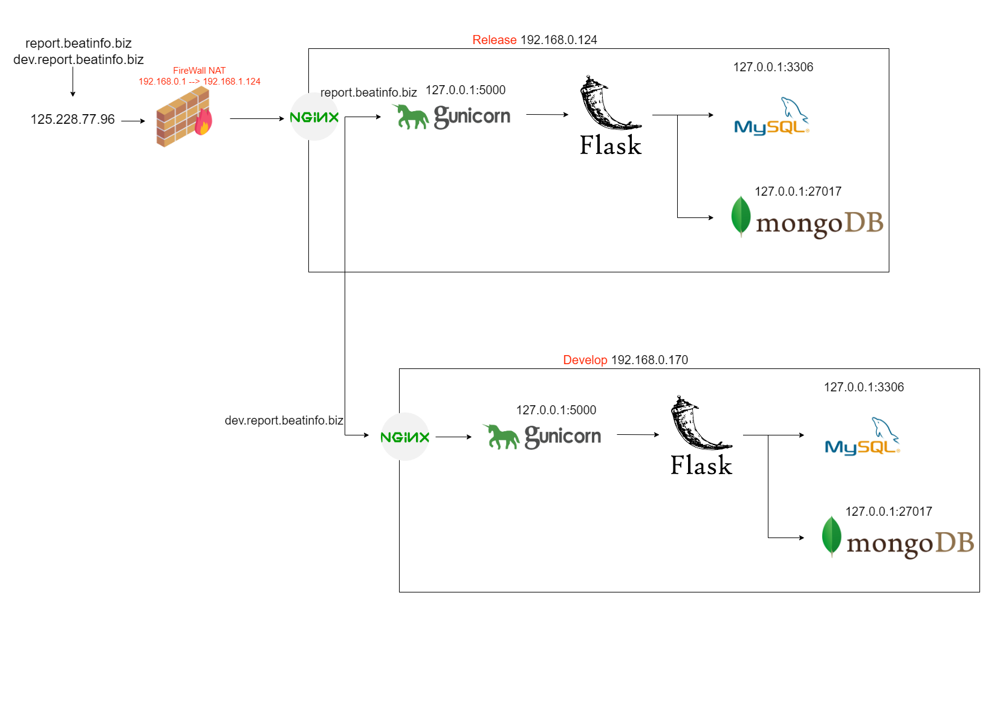

# Quick Start

## Deploy Project

1. Clone the repo

   ```
   $ git clone git@github.com:SingularWingsMedical/FWA10_Report_Server.git
   $ cd FWA10_Report_Server
   ```

2. Initialize and activate a virtualenv:

   ```
   $ source env/bin/activate
   ```

3. Install the dependencies:

   ```
   $ pip install -r requirements.txt
   ```

4. Run the server:

   ```
   $ cd scripts
   $ sh start.sh
   ```

5. Navigate to [http://localhost:5000](http://localhost:5000)

## Update Project

1. excute update script:
   ```
   $ cd scripts
   $ sh update.sh
   ```

## Backup Database

- [Crontab task](#crontab)

## Restore Database

- Store path
  - [ReportServerDevBackUp](https://drive.google.com/drive/folders/1chtE9vhsA6-qwJIJj6AHoDTyRH1VG8K_?usp=drive_link)
  - [ReportServerRelBackUp](https://drive.google.com/drive/folders/1KeZN7yq-uJxwupEmPowXr0PQ5aEg4uEV?usp=drive_link)

1. Restore MySQL:
   ```
   $ gzip -d {{.gzfile path}}
   $ mysql -u {{username}} -p{{password}} {{databasename}} < {{.sql path}}
   ```
2. Restore MongoDB:
   ```
   mongorestore --port={{port number}} d {{databasename}} --drop {{path}}
   ```
3. Restore PDF file:

- user_pdf/

## Server instance structure



# crontab

```
#開機執行
@reboot sleep 30; /home/koshou/FWA10_Report_Server/scripts/start.sh
#執行產報告任務
*/5 * * * * sh /home/koshou/FWA10_Report_Server/scripts/crontab.sh
#執行備份任務
30 00 * * * sh /home/koshou/FWA10_Report_Server/scripts/backup.sh
```

# Nginx Setting

## Develop

```
server {
  listen 80 default_server;
  listen [::]:80 default_server;
  server_name 192.168.0.170;
  location /{
    root /home/koshou/FWA10_Report_Frontend/dist/frontend/;
    index  index.html index.htm;
    try_files $uri $uri/ /index.html;
    add_header Cache-Control 'no-store, no-cache';
  }
  location /api {
    proxy_pass http://127.0.0.1:5000;
    proxy_http_version 1.1;
    proxy_set_header X-Real-IP $remote_addr;
    proxy_set_header X-Forwarded-For $proxy_add_x_forwarded_for;
  }
}

```

## Release

```
server {
  listen 80 default_server;
  listen [::]:80 default_server;
  root /var/www/html;
  index index.html index.htm index.nginx-debian.html;
  server_name 192.168.0.124;
  location / {
    proxy_pass http://127.0.0.1:5000;
  }
}

server {
  root /var/www/html;
  index index.html index.htm index.nginx-debian.html;
  server_name report.beatinfo.biz; # managed by Certbot
  location / {
    proxy_pass http://127.0.0.1:5000;
    proxy_http_version 1.1;
    proxy_set_header X-Real-IP $remote_addr;
    proxy_set_header X-Forwarded-For $proxy_add_x_forwarded_for;
  }
}
server{
  server_name dev.report.beatinfo.biz; # managed by Certbot
  location / {
    proxy_pass http://192.168.0.170;
    proxy_http_version 1.1;
    proxy_set_header X-Real-IP $remote_addr;
    proxy_set_header X-Forwarded-For $proxy_add_x_forwarded_for;
  }
}
server{
  server_name api.external.koshou.com;
  location / {
    proxy_pass http://127.0.0.1:5000;
  }
}
```

# Other

## unzip algorithm DL model( algorithm_version >= V113-037 不使用 )

```
$ unzip utility/algorithms/report/no_previous_label_with_2_gru.zip -d utility/algorithms/report/
```
